## Relatório em Português (Report in Portugues)
Favor clicar aqui (please click here) <a href="MVP_SprintIII_project_presentation_portuques.ipynb"> MVP_SprintIII_project_presentation_portuques.ipynb</a>

## Dataset
<a href="https://www.kaggle.com/datasets/olistbr/brazilian-ecommerce">Brazilian E-Commerce Public Dataset by Olist</a>

## Introduction
This project was conceived as part of my postgraduate course in Data Engineering at PUC-Rio, focusing on three main pillars: databases, data warehouses and data lakes, and data management and governance. It represents a unique opportunity to apply the theoretical concepts learned in a practical setting, using real data from the Brazilian e-commerce market. I chose to focus on the e-commerce sector not only due to its relevance and explosive growth in recent years, but also because the data is readily available and does not present confidentiality issues. In addition to providing a platform to enhance my skills in data manipulation and analysis, this project also allows me to explore some of the emerging trends in data science and big data, including automation, cloud computing, and specific tools from GCP (Google Cloud Platform).
## Goal
The main objective of this project is to use data from Brazil's largest e-commerce platform, Olist, which were obtained through the Kaggle platform, to perform trend and sales performance analyses. Due to resource limitations (using the trial version of GCP), our scope of analysis will focus on:

1. Sales trend analysis, including sales volume, revenue, and shipping costs.
2. Sales performance analysis, including seller ratings and product category performance.
3. Customer reactions to delivery time.

**Problem Statement**
This project will answer the following business questions:

1. What is the sales performance for the year 2018?
2. Which product categories are performing the best in terms of order volume and revenue?
3. How do customers react to delivery time? Is this related to customer satisfaction?
   
Due to the resource limitations of GCP and limited time, the current analysis is primarily based on questions that can be answered with the available resources. The results of the analysis will be stored in the GCP Bucket (Data Lake) and BigQuery (Data Warehouse).
## Data Modeling for E-commerce Analysis
In this e-commerce analysis project, we opted to use the Star Schema as the structure for our data modeling.

**Fact Table**
Order Items Fact Table:

This fact table is based on the olist_order_items_dataset.csv file, which contains multiple attributes of order items, such as Order ID, Product ID, price, and quantity, etc.

**Dimension Tables**
* Order Dimension: Contains data from the olist_orders_dataset.csv file, such as order date, order status, etc.
* Product Dimension: Contains data from the olist_products_dataset.csv and product_category_name_translation.csv files, such as product name, category, etc.
* Customer Dimension: Contains data from the olist_customers_dataset.csv file, such as customer name, address, etc.
* Seller Dimension: Contains data from the olist_sellers_dataset.csv file, such as seller name, address, etc.
* Review Dimension: Contains data from the olist_order_reviews_dataset.csv file, such as review score, review text, etc.
* Payment Dimension: Contains data from the olist_order_payments_dataset.csv file, such as payment type, payment value, etc.
* Geolocation Dimension: Contains data from the olist_geolocation_dataset.csv file, such as postal code, latitude, and longitude, etc.
  
These dimension tables are connected to our single fact table through foreign keys, forming a star schema.

Following is a structured model built using the Star Schema; this type of model is used for Business Intelligence applications. It consists of a central fact table (Fact Table -> List order_items) and one or more dimension tables (Dimension Tables). Through this model, it will be easier to quickly understand the relationships between each table.

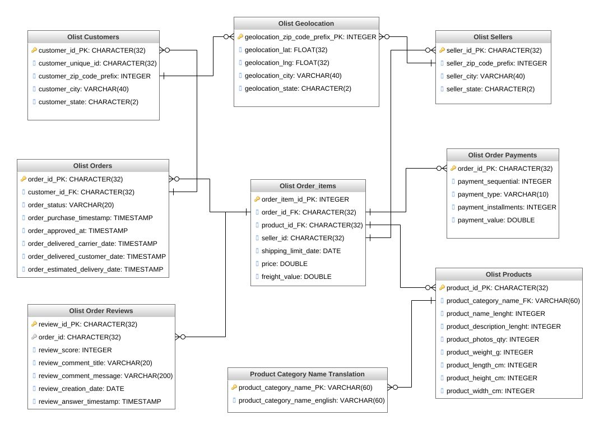

### Development and Testing on GCP's Dataproc via Jupyter Notebook
Prior to the final deployment of the ETL pipeline and execution of SQL queries, all developmental stages and tests were carried out within the Jupyter Notebook environment facilitated by Google Cloud Platform (GCP), utilizing PySpark. This initial phase ensures both the practicality and efficacy of the data transformation procedures, query operations, and other integral components of the data pipeline.

<a href="Dvelopment Stage/mvp_etl_query_develop.ipynb">Pre-Implementation: Development and Testing in Jupyter Notebook via GCP Dataproc</a>
## Data Loading
Firstly, I imported all the CSV data files into a Bucket on the GCP (Google Cloud Platform), serving as our Data Lake.
### How to upload dataset files via local computer terminal
Step by step:

>**1st, Create a 'key' in GCP IAM & Admin:**
>
>Please refer to the <a href="MVP_SprintIII_project_presentation_portuques.ipynb"> MVP_SprintIII_project_presentation_portuques.ipynb</a> file for more detailed steps.

>**2nd, Prepare Python script: upload_files.py**
>
>For your reference:<a href="upload_files.py"> upload_files.py</a>

>**3rd, Upload Python script in the terminal**
>```
>pip3 install google-cloud-storage
>export GOOGLE_APPLICATION_CREDENTIALS="/path/to/your/credentials.json"
>python3 upload_files.py
>```
>**4th, Insert the created "Service Account" into the 'Principal' of the bucket**
>```
>Acesse bucket
>Click PERMISSIONS->GRANT ACCESS ->
>Add 'service account' para Principals->
>Assign roles: select Cloud storage->storage object creator
>```
```
(base) leticia@ChendeMacBook-Air Desktop % python3 upload_files.py
/Users/leticia/Downloads/Brasilian_ecommerce_dataset/olist_sellers_dataset.csvhasbeenuploadedtoe_commerce/olist_sellers_dataset.csv.
/Users/leticia/Downloads/Brasilian_ecommerce_dataset/olist_orders_dataset.csvhasbeenuploadedtoe_commerce/olist_orders_dataset.csv.
/Users/leticia/Downloads/Brasilian_ecommerce_dataset/olist_order_items_dataset.csvhas been uploaded to e_commerce/list_order_items_dataset.csv.
/Users/leticia/Downloads/Brasilian_ecommerce_dataset/olist_products_dataset.csvhasbeenuploadedtoe_commerce/olist_products_dataset.csv.
(base) leticia@ChendeMacBook-Air Desktop %
```
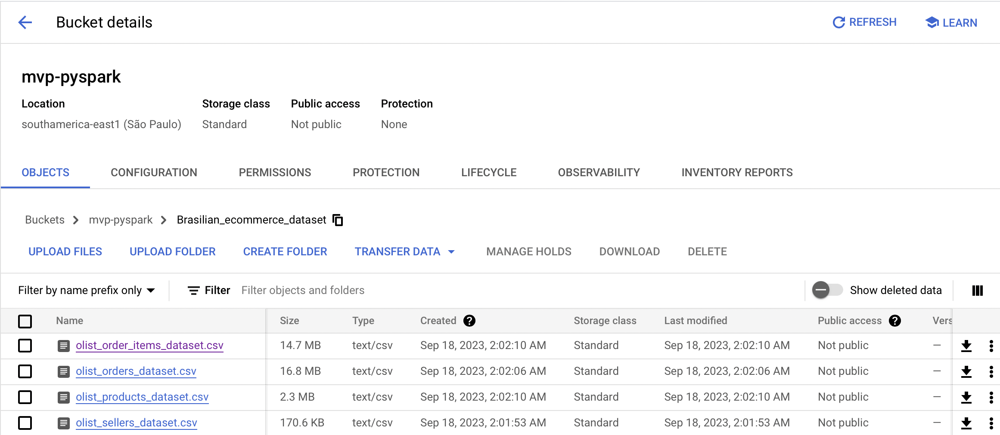

## Create Cluster in GCP Dataproc
Please refer to the <a href="MVP_SprintIII_project_presentation_portuques.ipynb"> MVP_SprintIII_project_presentation_portuques.ipynb -> 'Criar Cluster no GCP Dataproc'</a> file for more detailed steps.

## Data Analysis
Before extracting data from the Data Lake (GCS) and importing it into our data warehouse (BigQuery), a series of cleaning and pre-processing tasks need to be performed to ensure data consistency and accuracy. 

In a PySpark environment, use df.printSchema() to check if the data types are correct. Below is the result of checking one of the datasets.
```
# Schema do olist_order_items_dataset.csv
root
 |-- order_id: string (nullable = false)
 |-- order_item_id: string (nullable = false)
 |-- product_id: string (nullable = false)
 |-- seller_id: string (nullable = false)
 |-- shipping_limit_date: string (nullable = false)
 |-- price: string (nullable = false)
 |-- freight_value: string (nullable = false)
```
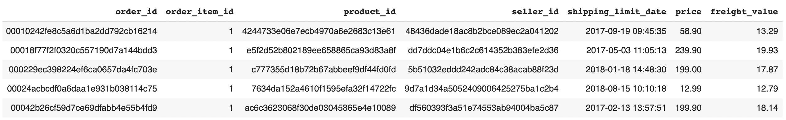
Based on the schema information, it is observed that some data types of the columns are incorrect after reading, so it is necessary to address this during the transformation stage. In addition, missing data parts will be filled with 'null'. Additionally, since the project does not involve machine learning at this stage, 'one-hot encoding' will not be applied.

Due to the fact that each data file may contain more than 112,650 rows, it was decided to keep only the necessary attributes (columns) when creating new tables for query analysis.

>**In response to the first question - Create the trend_analysis table**
   
>The purpose of creating the trend_analysis table is to understand the dynamics of the business over time. This table is the result of a join operation between
>
>* olist_order_items_dataset.csv and
>* olist_orders_dataset.csv
>  
>Through this table, we can perform various time-series analyses, including but not limited to, quarterly sales reports and annual revenue growth.
>
>The columns included in this table, such as sales_quantity, revenue, freight_cost, and order_approved_at, have been carefully selected. Specifically, the order_approved_at timestamp allows us to deepen our understanding of how to improve sales strategies within specific time periods.

>**In response to the second question - Create the sales_performance table**
>
>The purpose of creating the sales_performance table is to provide a comprehensive view for assessing the sales performance of different product categories and sellers. This table is the result of a join operation between
>* olist_order_items_dataset.csv,
>* olist_products_dataset.csv, and
>* olist_sellers_dataset.csv.
>Through this table, we can perform multi-dimensional sales analyses, such as which product categories are most popular, which sellers have the best sales performance, or in which regions there are more orders.

>The selected columns like order_id, product_id, seller_id, product_category_name, price, shipping_limit_date, and seller_state have specific purposes. For example, seller_state is used for geographical location analyses, which is very useful for understanding which regions have more active sellers or buyers.

>**In response to the third question - Create the Average Delivery Time Analysis by State table**
>
>The purpose of creating this table is to understand the impact of delivery time on customer satisfaction. The table is generated from a join between
>* olist_orders_dataset.csv and
>* olist_order_reviews_dataset.csv
>This table allows us to analyze how different delivery times affect customer reviews, which is crucial for optimizing logistics and increasing customer satisfaction.

>The columns retained after the join include order_id, order_purchase_date, order_delivered_customer_date, and review_score. These fields are essential for calculating the average delivery time and correlating it with the customer review score. Through this table, we can perform queries that help us better understand how to optimize our delivery time to improve customer experience.

## ETL Pipeline Development and Submitting it as a Dataproc Job
In the implementation of the ETL, two approaches were adopted. The first involves writing the ETL as a Python script, submitting it as a job, and then creating a workflow and cloud scheduler for automatic execution (creating the first and second table). The second approach uses Dataprep to create the ETL in a visual environment (generating the third table).
### Method 1: Write the ETL pipeline in a Python script and then submit it as a job, followed by combining the use of workflow and Cloud Scheduler to achieve automation
Below is the ETL pipeline developed in Python script:

Please click here <a href="ETL_pipeline_final.py">ETL_pipeline_final.py</a>

For the following steps, you can click here <a href="MVP_SprintIII_project_presentation_portuques.ipynb"> MVP_SprintIII_project_presentation_portuques.ipynb</a> for more details

* Submit Jobs
* Workflow Template creation - Insert Job into Dataproc Workflow
* Cloud Scheduler creation to Automate Workflow Execution
  ```
   # The codes to 'submit a job' in the terminal
   gcloud auth login
   gcloud config set project [seu projeto ID]

   gcloud dataproc jobs \
   submit pyspark /path/to/file/ETL_file_name.py \
   --cluster=seu-cluster-name \
   --region southamerica-east1 \
   --jars=gs://spark-lib/bigquery/spark-bigquery-with-dependencies_2.12-0.26.0.jar
  ```
### Method 2: Develop the ETL pipeline using Cloud Dataprep and enable scheduling for automated execution
Click here <a href="MVP_SprintIII_project_presentation_portuques.ipynb"> MVP_SprintIII_project_presentation_portuques.ipynb</a> for step-by-step instructions

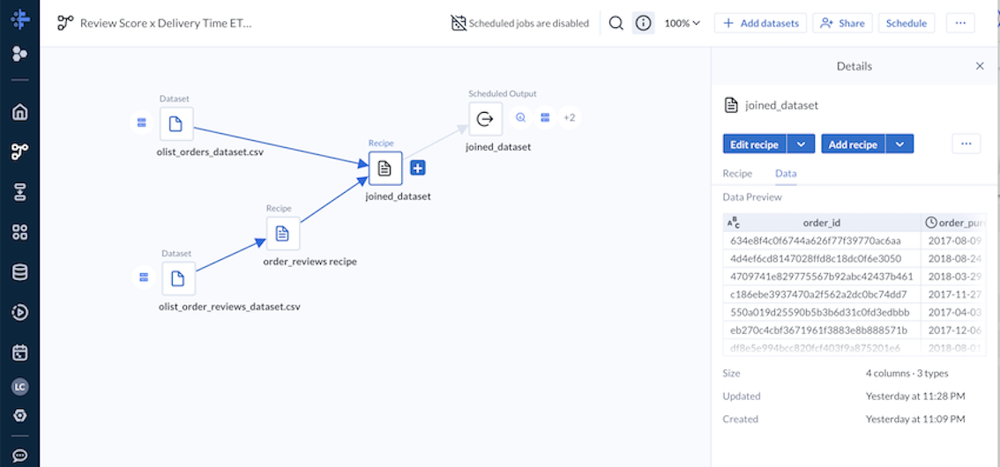

## Data Quality Applied
Navigate to Dataplex -> click 'Data Quality' -> click 'CREATE DATA QUALITY SCAN' to implement rules.

Due to the lack of deduplication of order_id in the sales_performance transformation within the Python ETL script, errors were identified during the data quality check. Since the table is already in BigQuery, the correction needs to be made there.

The Data Quality result for the 'sales_performance' table in Dataplex:

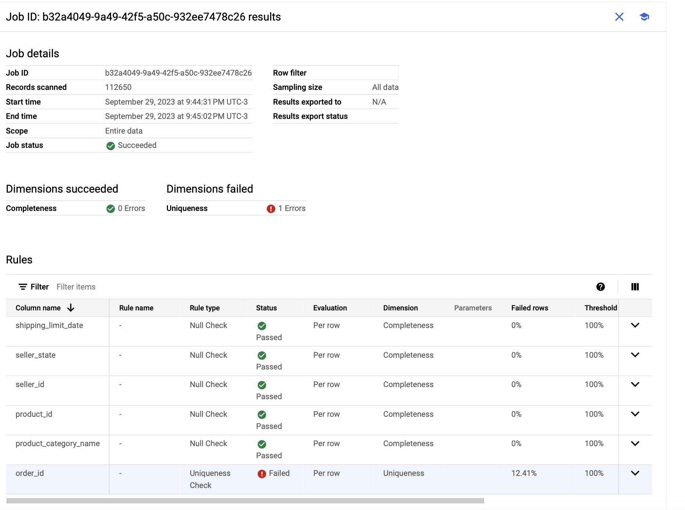

**To resolve the duplication issue, data cleansing is performed in BigQuery**
```
CREATE OR REPLACE TABLE solar-dialect-397419.e_commerce.sales_performance AS
SELECT *
FROM (
  SELECT *,
         ROW_NUMBER() OVER (PARTITION BY order_id ORDER BY TIMESTAMP(shipping_limit_date) DESC) AS rn
  FROM solar-dialect-397419.e_commerce.sales_performance
)
WHERE rn = 1;
```
**After removing duplication, the status turns to 'Passed':**
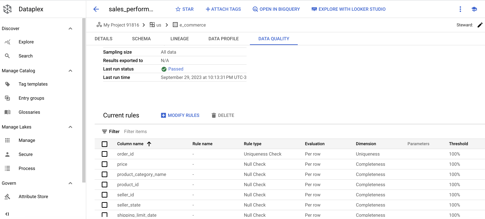

## Deploy Data Catalog
In this project, data catalog settings are applied to datasets in two locations:

* Tables in BigQuery
* Tables or files in the GCS bucket
  
Please click here <a href="MVP_SprintIII_project_presentation_portuques.ipynb"> MVP_SprintIII_project_presentation_portuques.ipynb</a> for step-by-step instructions.

Results for one of the tables in BigQuery:
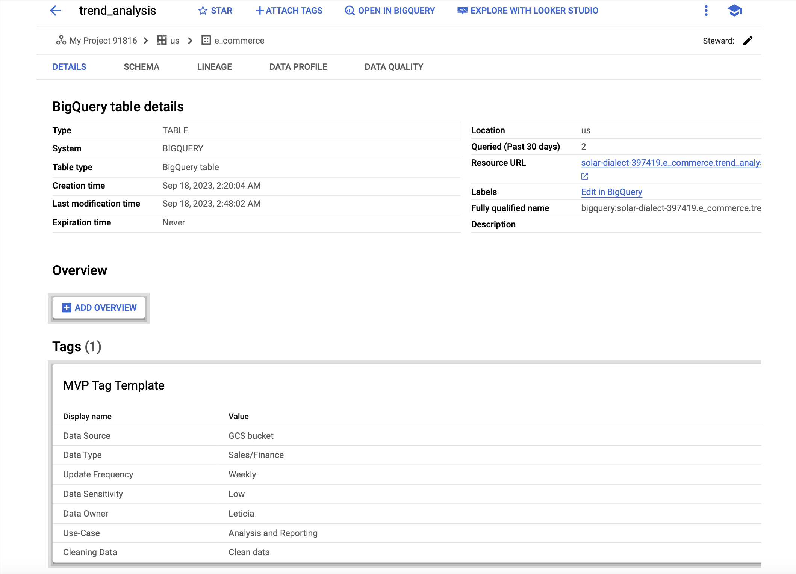

Results for files in the GCS bucket:
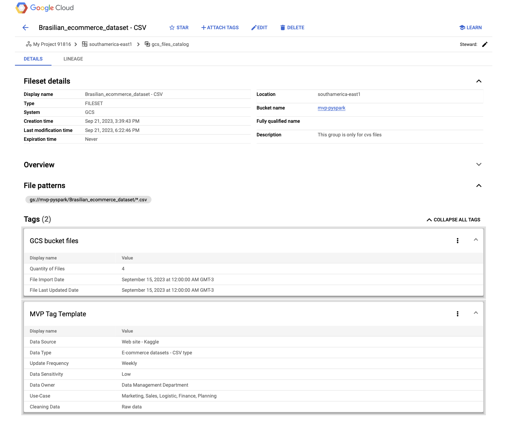

## Data Analysis with BigQuery and Visualization with Cloud Studio
To answer the project questions, I generated three main tables for data analysis. These analyses will be conducted in BigQuery, and the results will be visualized using Cloud Studio.
### 1st Question: How is the sales performance for the year 2018?
To answer this question, two analyses were conducted.

**Analysis 1: This analysis can help understand which sellers have the best sales performance in the year 2018, both in terms of order volume and revenue. This, in turn, allows for more effective inventory management and sales strategy planning.**
```
# Por volume de pedidos
# sellers_ranking_by_order_by_year
CREATE OR REPLACE TABLE solar-dialect-397419._scriptd4e59ccc8771f6e76dee66499daca94bff9c9ecd.seller_performance AS
SELECT
    seller_id,
    EXTRACT(YEAR FROM shipping_limit_date) AS shipping_year,
    seller_state,
    COUNT(order_id) AS total_orders,
    ROUND(SUM(price), 2) AS total_revenue
FROM solar-dialect-397419.e_commerce.sales_performance
GROUP BY seller_id, shipping_year, seller_state;

SELECT
    seller_id,
    shipping_year,
    seller_state,
    total_orders,
    total_revenue,
    RANK() OVER (PARTITION BY shipping_year ORDER BY total_orders DESC) AS rank
FROM solar-dialect-397419._scriptd4e59ccc8771f6e76dee66499daca94bff9c9ecd.seller_performance
WHERE shipping_year = 2018
ORDER BY shipping_year, rank
LIMIT 50;
```
Result in BigQuery:
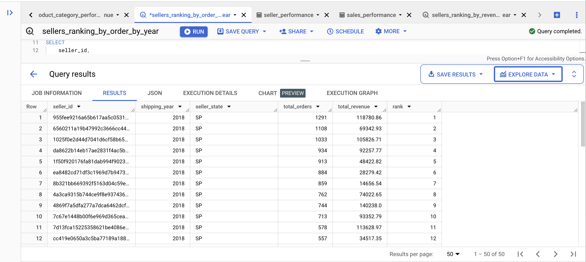
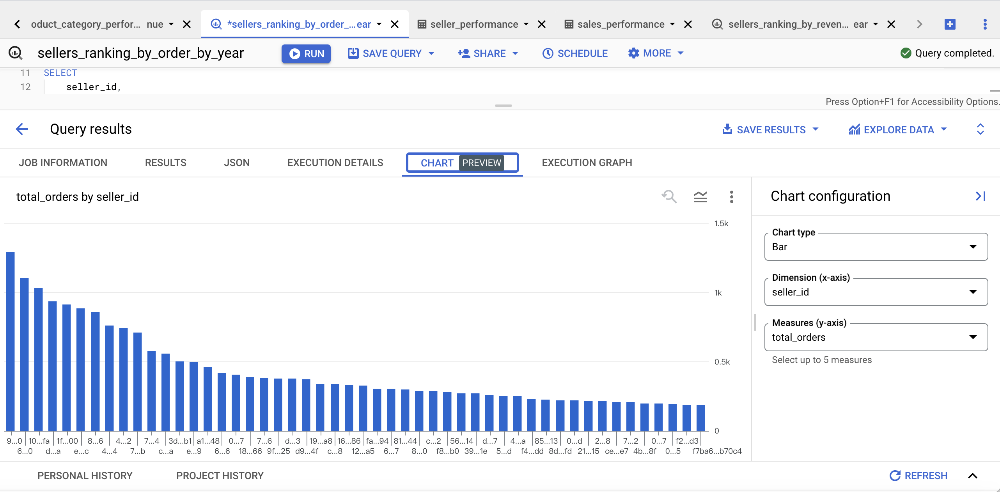

```
# Por receitas
# sellers_ranking_by_revenue_by_year

SELECT
    seller_id,
    shipping_year,
    seller_state,
    total_orders,
    total_revenue,
    RANK() OVER (PARTITION BY shipping_year ORDER BY total_revenue DESC) AS rank
FROM solar-dialect-397419._scriptd4e59ccc8771f6e76dee66499daca94bff9c9ecd.seller_performance
WHERE shipping_year = 2018
ORDER BY shipping_year, rank
LIMIT 50;
```
Result in BigQuery:
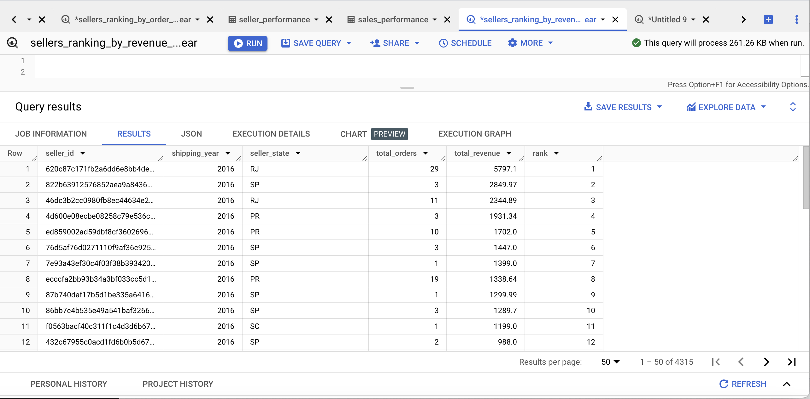

Through the ranking of the top 50 sellers in terms of revenue, we can observe that some sellers actually made only one order in 2018 but still rank among the top 50 in revenue. Therefore, we can adjust the query to find out that there are a total of 14 sellers in this situation.
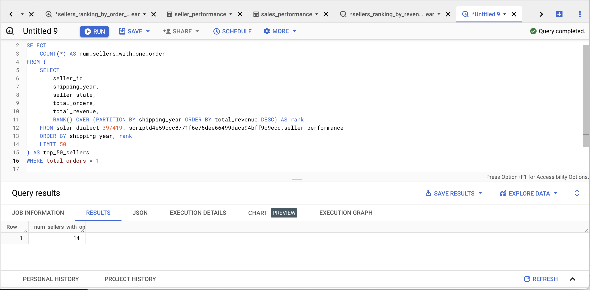

**Analysis 2: Sales Trends by Product Category**

**Objective: To understand which product categories are most popular.**
```
# product_category_performance

WITH TopOrders AS (
  SELECT product_category_name,
         COUNT(order_id) AS total_orders
  FROM solar-dialect-397419.e_commerce.sales_performance
  GROUP BY product_category_name
  ORDER BY total_orders DESC
  LIMIT 20
),
TopRevenue AS (
  SELECT product_category_name,
         ROUND(SUM(price), 2) AS total_revenue
  FROM solar-dialect-397419.e_commerce.sales_performance
  GROUP BY product_category_name
  ORDER BY total_revenue DESC
  LIMIT 20
)
SELECT t1.product_category_name, t1.total_orders, t2.total_revenue
FROM TopOrders t1
INNER JOIN TopRevenue t2 ON t1.product_category_name = t2.product_category_name
ORDER BY t1.total_orders DESC, t2.total_revenue DESC;
```
Result presented in Cloud Studio:
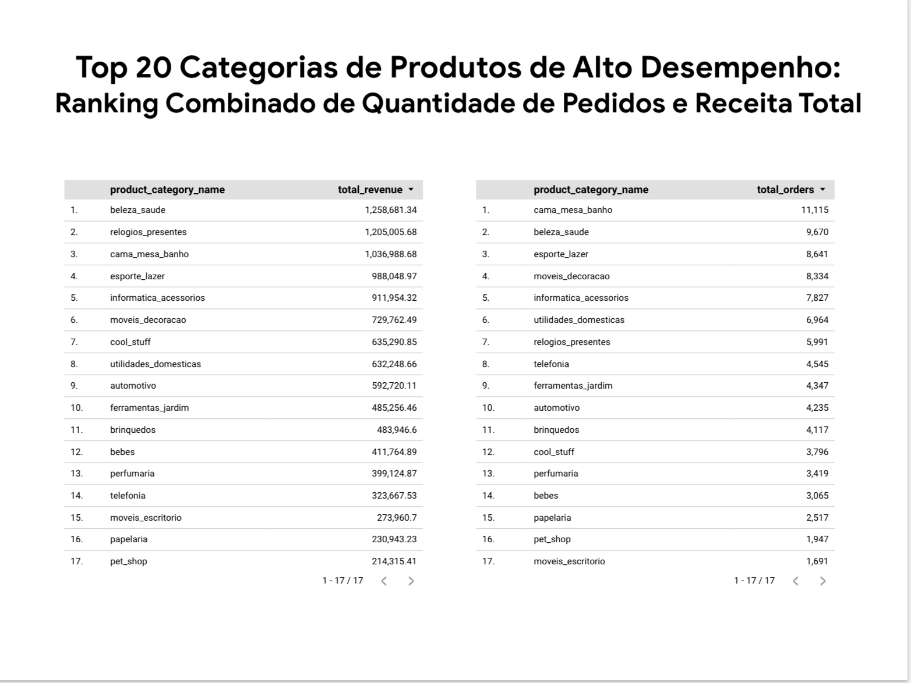

### 2nd Question: Based on performance over the years, what is the status of shipping costs?
Temporal Trends Analysis

* Principle of the Analysis: Conduct monthly and yearly analyses to understand fluctuations in sales volume, revenue, and shipping costs.
* Objective: To identify temporal trends in sales, revenue, and shipping costs to enable more effective business forecasting and resource allocation.

These analyses will assist in:

1. Performance Forecasting: By observing sales, revenue, and shipping costs over different time periods, you can predict future performance.
2. Resource Allocation: Understanding the trends in these three indicators (sales, revenue, shipping costs) aids in more effective resource allocation.
3. Strategy Adjustment: These data can help you identify business areas that need improvement or maintenance.
4. Cost Control: Analyzing shipping cost trends contributes to cost control and supply chain optimization.
```
SELECT
    month_year,
    COUNT(sales_quantity) AS `Sales Quantity`,
    SUM(revenue) AS `Revenue`,
    SUM(freight_cost) AS `Freight Cost`
FROM solar-dialect-397419.e_commerce.trend_analysis
GROUP BY month_year
ORDER BY month_year;
```
Result presented in Cloud Studio:
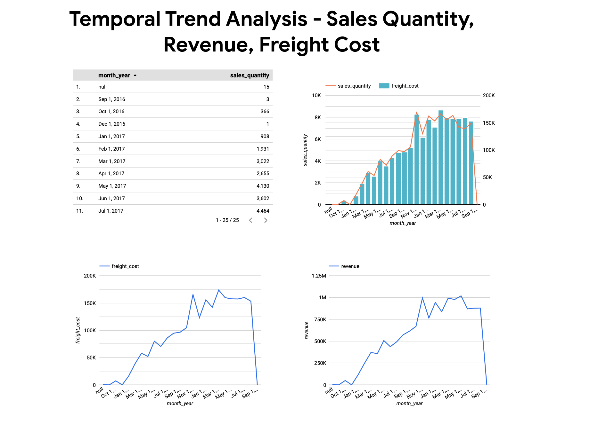

### 3rd Question: How do customers react to delivery time?
**Table created in Dataprep and output to BigQuery**

At this point, one row was removed because all the data was concentrated between the years 2016 and 2018. The only exception was one row from the year 2020, which was identified as an outlier.

Data processing in Dataprep:
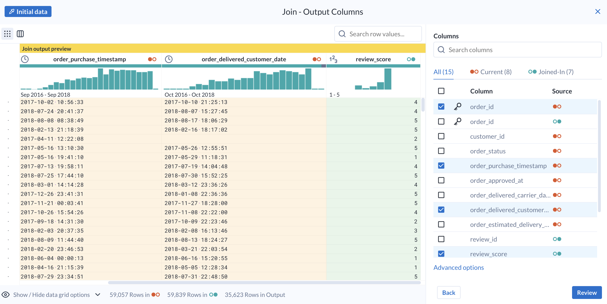

Analysis of Average Delivery Time by State

**Objective: To understand the average delivery time in order to optimize logistics and increase customer satisfaction.**
```
SELECT
    CEIL(AVG(TIMESTAMP_DIFF(TIMESTAMP(order_delivered_customer_date), TIMESTAMP(order_purchase_date), HOUR)) / 24) AS avg_delivery_time_days,
    review_score
FROM
    solar-dialect-397419.e_commerce.joined_dataset
GROUP BY review_score
```

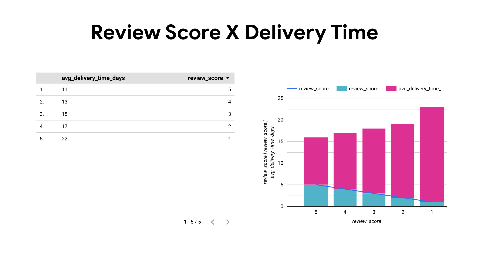

## Self-Assessment
For this project, I not only learned the entire ETL (Extract, Transform, Load) construction process but also succeeded in implementing these workflows on the Google Cloud Platform cloud. This project is a practical simulation based on e-commerce, but as I am using a test account, there are certain resource limitations. Therefore, I chose to define only three main analytical questions. The advantage is that I don't need to use the entire dataset for analysis. During data analysis with BigQuery, I gained a lot of valuable experience in terms of data availability. At least after answering these three questions, I realized that each of them has the potential for deeper analyses.

Next, I will discuss in detail the self-assessment after each analytical question, including the challenges I faced during these analyses and directions for future optimizations.

**Regarding the first analysis of the first question,** I was able to obtain a performance ranking of sellers based on sales volume and sales value. However, to make this analysis more useful and in-depth, a more comprehensive approach would be to first calculate the average sales over the previous years. Then, I could compare how much the 2018 sales exceed this average in percentage terms and focus especially on the sellers who are performing above average. This would allow me to understand why these sellers are doing better than average, thus providing directions and strategies for improvements.

**Concerning the second analysis of the first question,** I was able to provide valuable insights for the company's decision-making layer, indicating which products are not only more profitable but also more popular in the market. However, there is still room to deepen this analysis. For example, we could examine in more detail the sales growth trends of the top 20 best-selling products over the years. This would not only provide a more comprehensive view of the market but also help the company plan more accurate sales strategies for the future.

**Regarding the second question,** I was able to clearly analyze that transport costs are closely tied to the proportional growth of sales and sales volume. However, there is still room for improvement in this analysis. We can investigate further, for example, what is the percentage of sales performance in areas where transport costs are particularly high relative to total sales. This more detailed analysis will provide additional valuable insights for the company's decision-making, such as the need to adjust logistics or sales strategies.

**Regarding the third question,** I was able to analyze in detail that the customer review scores have a significant inverse relationship with the delivery time. However, to make this analysis more valuable, I suggest that we study more deeply the average delivery time in each state and how the reviews are in those locations. This more in-depth analysis by region will help us more accurately adjust and optimize transportation and customer service strategies, thereby increasing customer satisfaction.

